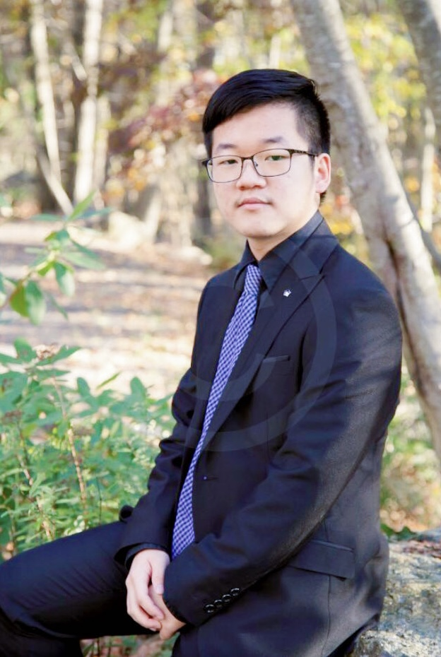

# Computer Science Student

  

### Education
Communication, BA & Computer Science, MA (In Progress)

### Work Experience
Sales Representative @ Hican International Consulting Ltd.

### Projects 
  - Program to check if a binary tree is a BST 
  - [Program to calculate the number of nodes and leaf nodes in a binary tree] (https://github.com/Bowenniu/Calculate-Nodes)
  - 
