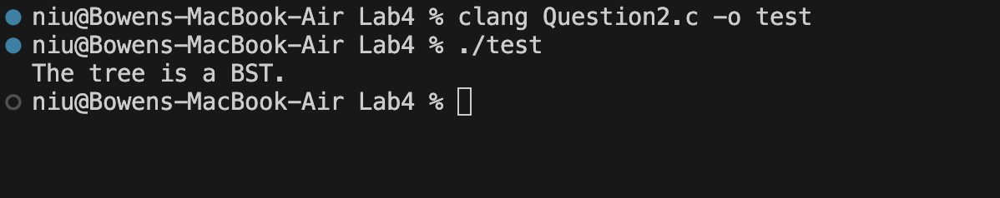
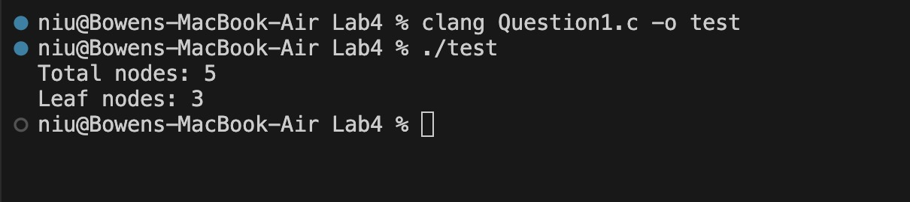

# Computer Science Student

### Education
Communication, BA & Computer Science, MA (In Progress)

### Work Experience
Sales Representative @Hican International Consulting Ltd.

### Projects 
- **Program to check if a binary tree is a BST**
  
  [Link to GitHub Repository](https://github.com/Bowenniu/BST)
  This project is a program that checks if a binary tree is a BST.
- **Program to calculate the number of nodes and leaf nodes in a binary tree**
  
  [Link to GitHub Repository](https://github.com/Bowenniu/Calculate-Nodes)
  This project calculates the number of nodes and leaf nodes in a binary tree.
### Social Media

As a Communication BA graduate, I love to create content and videos. In recent years, I've traveled a lot and recorded my trips through vlogs. 

[Link to Bilibili](https://space.bilibili.com/10501911?spm_id_from=333.1007.0.0)
